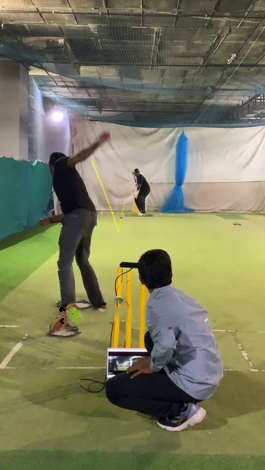

# Ball Tracking and Triangulation

**Project Title**: Ball Tracking and Triangulation  
**Company**: Spookfish Innovations Private Limited  
**Duration**: January 2023 - May 2023  
**Mentors**: Dr.Sudeep Sundaram, Ms.Malika Soni

## 1. Introduction

Ball tracking systems in cricket are advanced technological solutions that have revolutionized the way the game is played and analyzed. These technologies provide precise and reliable assessment of various parameters such as the speed, trajectory, and spin of the cricket ball. They have become an integral part of modern cricket, providing players, coaches, and commentators with valuable insights and analysis. 

The ball tracking system consists of multiple cameras placed at different angles around the cricket field. These cameras capture high-speed footage of the cricket ball as it is bowled, travels through the air, and hits the ground or the batsman’s equipment. The system then uses advanced algorithms and software to analyze this footage and generate a three-dimensional model of the ball’s flight path. One of the key parameters that the ball tracking system measures is the speed of the ball. The system can also calculate the spin rate and direction of the ball, which is critical information for both bowlers and batsmen. In conclusion, the ball tracking system is a revolutionary invention that has redefined the way cricket is played and analysed. 

    

    <em>Figure 1.1: Ball Tracking System in Cricket</em>

### 1.1 Motivation

- **Decision Review System (DRS)**: Ball tracking technology is widely used in cricket to assist with umpiring decisions, particularly in the case of LBW (leg before wicket) appeals. The DRS system uses multiple cameras to track the ball’s trajectory and predict whether it would have hit the stumps or not.
- **Performance Analysis**: Ball tracking technology can be used to analyze a player’s performance by tracking the trajectory of each ball they face or bowl. This data can provide insights into the player’s technique, strengths, and weaknesses, and can help coaches develop more effective training programs.
- **Broadcasting**: Ball tracking technology is also used in cricket broadcasts to provide viewers with a better understanding of the action on the field. Graphics showing the trajectory of the ball, the speed of the delivery, and the impact location on the bat or pad can help viewers follow the game more closely.

### 1.2 Problem Statement

The problem of ball tracking involves accurately detecting and following the trajectory of the ball in real-time using computer vision techniques.

### 1.3 Objectives

The objectives of this project are specified in terms of the project’s outcomes.
- Identify available methods of ball tracking system.
- Develop suitable method to detect and track the ball in real time scenario.
- Validate the results obtained.

## 2. Design and Dataset Description

System design is the procedure of defining and developing a system that satisfies specified
requirements of the project.

### 2.1 Functional block diagram
The architectural design of a system highlights the structure, behaviour, interfaces and more
views of that system and analysis. A functional block diagram for a ball tracking system typically consists of the following blocks

##### 1. Input block 
Camera Feed: Captures the live video feed from the camera positioned in proper setup.
##### 2. Pre-processing block
Camera Calibration: Determines camera parameters, corrects lens distortion, and establishes
the mapping between pixel coordinates and real-world coordinates.
##### 3. Ball detection block
Image Segmentation: Separates the ball from the background by applying segmentation algorithms. Feature Extraction: Extracts relevant features from the segmented ball region, such as
color, shape, and texture.
##### 4. Post-processing block
Filtering Algorithm : Application of filtering algorithm in order to remove false detection’s and
achieve more accurate results
##### 5. Output block
Visualization : Presents the ball’s position, trajectory, and other relevant information through
graphical overlays, on-screen graphics, or user interfaces.

    

    <em>Figure 2.1: Functional block diagram</em>

### 2.2 Dataset description

The dataset consists of videos captured with an iPhone using a standard setup similar to `FULLTRACK AI`, i.e the phone is simply placed on a tripod at the beginning of a session, pointed at the sporting environment. The videos have a frame rate of `x` frames per second and a resolution of `width x height`  pixels. The quality of the videos is high, with clear visibility of the ball in each frame, unaffected by motion blur or other artifacts. This dataset serves as a reliable and foundational reference for ball tracking and analysis tasks.

## 3. Implementation Details

This chapter gives a brief description about implementation details of the system by describing each of its component. It includes various approaches towards ball tracking, optimisation methods used, computer vision techniques to find the bounce point, mathematical approaches to find the future flight of the ball, calibration approaches to remove distortions that affect camera, depth estimation and perspective transformations.

> Implementation details are not provided here due to company policy.

## 4. Results and discussions

The Results section in this report presents the outcomes obtained from the experiments. It provides a structured way to describe the outputs, its advantages and limitations

### 4.1 Ball tracking
Various experiments were conducted in order to achieve the ball tracking, below are the results.

#### 4.1.1 OpenCV trackers
OpenCV built-in trackers such as Boosting, MIL, KCF, TLD, Median Flow, MOSSE, CSRT were utilized for ball tracking. But the above methods were not successful because of following reasons
- Sensitivity to changes in lighting conditions
- Difficulty in tracking objects with similar appearance
- Lack of robustness to occlusion

#### 4.1.2 Color based approach
Ball tracking using color had certain limitations. It is sensitive to the changes in lighting conditions, shadows, and color variations, which resulted in inaccurate tracking. Additionally, multiple objects with similar colors that were present in the scene, the tracking algorithm struggled to differentiate the ball from the other objects.

    

    <em>Figure 4.1: Ball Tracking using colour based approach</em>

#### 4.1.3 Using blob detection
OpenCV provides a convenient way to detect and filter blobs based on different characteristics.The algorithm detects the blobs, and the filtering can be done using the parameters for SimpleBlobDetector such as area, threshold, circularity, inertia and convexity. But using above algorithm for ball detection lead to too many false detections, because of the objects in the scene that share similar properties such as ball.

    

    <em>Figure 4.2: Ball tracking using blob detection</em>

#### 4.1.4 Using Yolo v7
Since the application was intended to work on edge device, for ball tracking using Yolo, the inference time for each frame was about 1.17 secs, practically a 60 fps video of 5-6 secs contains 400 frames. So it is practically inefficient to use deep learning model such as YOLO for ball tracking. Also yolo requires significant computational resources for both training and inference, making it more suitable for systems with ample computing power.

    
    

    <em>Figure 4.3: Ball tracking using Yolo v7</em>

#### 4.1.5 Using circularity and contour based approach

Ball tracking using this approach use a series of image processing techniques, which is achieved by OpenCV. The extraction of the ROI, image, colour space conversion, noise filteration, static object removal, thresholding, attribute based object detection are among them. 

Out of all the explored approaches, this approach had better accuracy and was computationally efficient. Even this method is prone to noise ( false detections of the ball), there is need of filtering
algorithms to filter out false detections.  

    

    <em>Figure 4.4: Ball Tracking using circularity and contour based approach</em>

### 4.2 Filtering methods
Below are the results of 2 filtering algorithm used to remove the false detections of the cricket ball.They are
#### 4.2.1 K-nearest neighbor’s method
This method successfully filters most of false detections. But this method fails when there are
group of false points as average distance for them is lesser than defined threshold

#### 4.2.2 RANSAC method (RANdom SAmple Consensus)
The RANSAC method was implemented with both linear and polynomial models as backbone, the one with polynomial regression achieved better filtering performance. This methods seperate the set of 2d data points into inliers and outliers, only inliers are used for building the trajectory

    
    

    <em>Figure 4.5: Filtering the trajectory of the ball</em>

### 4.3 Finding the bounce point of the ball
The bounce point of the ball could be found using perspective transform of the image. In below
example a pitch is simulated where it contains start and end line at distance of 25 ft with each
object kept 5 ft away. Once perspective transform is performed the pixel distance between each
of the object is same, proving the theory. similarly same concept can be applied to cricket pitch.

    
    

    <em>Figure 4.6: Example of Perspective Transform</em>

 

    

    <em>Figure 4.7: Perspective Transform of the pitch area</em>

### 4.4 Construct complete trajectory of the ball
In order to construct the complete trajecory we need location of the ball in every frame, it is achieved using polynomial regression technique. The polyfit function in NumPy provides a convenient way to fit a polynomial curve to a set of data points. It uses the method of least squares to find the coefficients of the polynomial that best fits the data. These coefficients are used to find all the intermediary points of the trajectory.

    
    
    

    <em>Figure 4.8: Construction of ball’s trajectory using polyfit</em>

### 4.5 Predict future flight of the ball
Kalman filtering is an algorithm that provides estimates of some unknown variables, given the measurements observed over time. This algorithm is used to predict the future flight of the ball. The filter initializes the state of the system based on prior knowledge. In each step the Kalman filter predicts state of the system based on previous state. Once new measurements of system become available the algorithm updates its estimate of the state. Below are the results

    
    

    <em>Figure 4.9: Future flight prediction using kalman filter algorithm (State view, Points view)</em>

### 4.6 Finding the extrinsics using perspective-n-point
To estimate the pose (position and the orientation) of a camera when the 2D projections of 3D points are given. We use OpenCV solvepnp() to estimate the orientation of a 3D object in a 2D image. The solvePnP and related functions estimate the object pose given a set of object points, their corresponding image projections, as well as the camera intrinsic matrix and the distortion coefficients. This returns the rotation vectors (Rx, Ry, Rz) and the translation vectors (Tx, Ty, Tz) that transform a 3D point expressed in the object coordinate frame to the camera coordinate frame

    
    

    <em>Figure 4.10: Solving perspective-n-points</em>

    

    <em>Figure 4.11: Rotational & Translational Vectors as output</em>

## 5. Conclusions and future scope
### 5.1 Conclusion
In this report, we explored various approaches for ball tracking in computer vision applications. We experimented with various approaches. Among these methods, the circularity and contour-based approach showed better accuracy and computational efficiency.We also discussed two noise filtering methods, namely the K-Nearest Neighbor’s method and the RANSAC method. Both methods effectively filtered out false detections of the ball, with the RANSAC method using polynomial regression achieving better filtering performance. The polyfit function in NumPy helped fit a polynomial curve to the data points, enabling us to find intermediary points of the trajectory. To predict the future flight of the ball, we utilized the Kalman filter algorithm. Finally, we discussed the estimation of depth using stereo vision. By capturing images from a stereo setup and performing stereo rectification, we applied triangulation to find the depth of a point.

### 5.2 Future scope
Although this report provides insights into ball tracking and trajectory prediction using computer vision techniques, there are several areas that can be explored further:

- **Integration of Triangulation concept**: In the above system estimation of depth is discussed. Initially synchronization needs to be achieved among the cameras in order to calculate the depth, and model all the coordinates (x, y, z) in 3d reference frame.

- **Incorporate with real-time systems**: The developed algorithms and methods can be further optimized and integrated into real-time systems to track and predict the trajectory of a ball in real-world scenarios.

- **Improved ball detection**: Investigate advanced techniques, such as deep learning models or hybrid approaches, to improve ball detection and tracking accuracy while minimizing false detections.

- **Robustness to environmental variations**: Enhance the algorithms’ robustness to changes in lighting conditions, shadows, and color variations by incorporating adaptive techniques and advanced image processing methods.

- **Integration with 3D visualization**: Develop a 3D visualization component to provide amore intuitive representation of the ball’s trajectory and its interaction with the environment.
